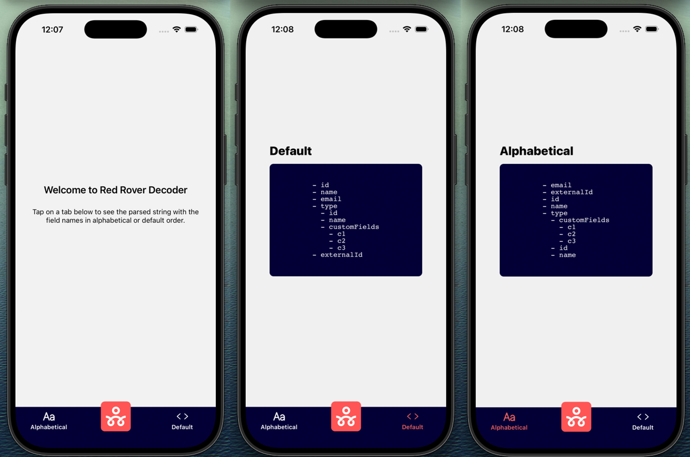

# Red Rover Decoder

This is an [Expo](https://expo.dev) project created with [`create-expo-app`](https://www.npmjs.com/package/create-expo-app).

## Get started

1. Install dependencies

   ```bash
   npm install
   ```

2. Start the app

   ```bash
   npx expo start
   ```

   

3. Test the string parsing

- The core logic is located in `view-models/parserViewModel.ts`. 
- Input strings are defined in `view-models/rawData.ts`.
- Swap out the `inputString` assignment try out the included edge cases or add your own.

4. Developer note

- The error handling covers most edge cases, but one edge case that is not properly handled is a single missing closing parethesis. The string still seems to be parsed correctly, but the malformed input is not identified. I wasn't able to find an easy way to handle this without attempting a significant overhaul of the logic. There's definitely room for improvement in code readability, correctness, and organization.


In the output, you'll find options to open the app in a

- [development build](https://docs.expo.dev/develop/development-builds/introduction/)
- [Android emulator](https://docs.expo.dev/workflow/android-studio-emulator/)
- [iOS simulator](https://docs.expo.dev/workflow/ios-simulator/)
- [Expo Go](https://expo.dev/go), a limited sandbox for trying out app development with Expo
